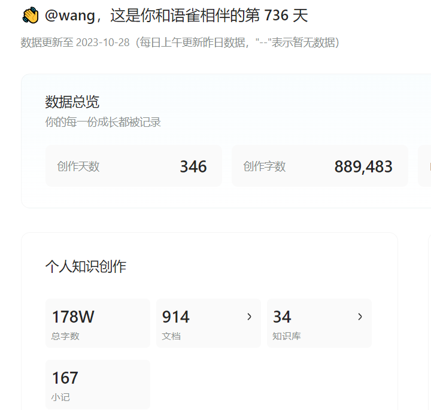
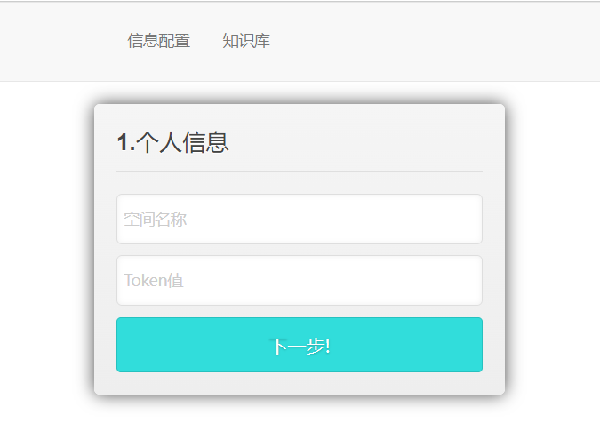
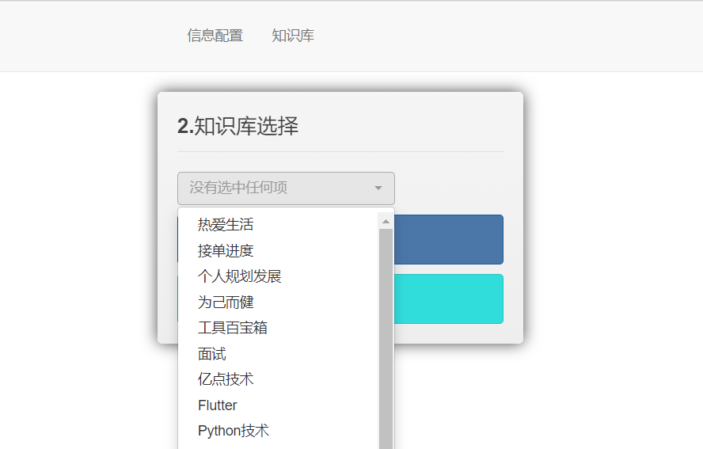
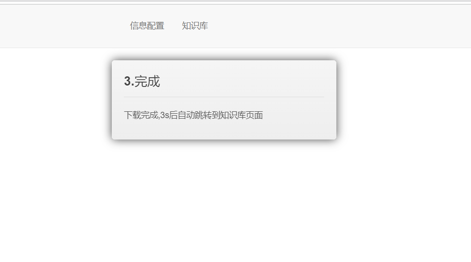
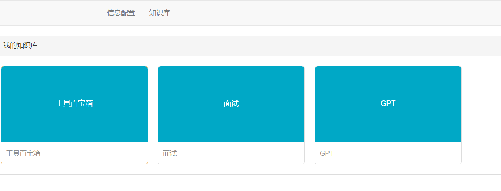

# NativeYuQue
语雀文档MarkDown本地备份；基于Django-web预览文档。

# 内容列表
- [背景](#背景)
    
    语雀作为我个人协作工具的首选，提供了出色的便利性。
    然而，上周经历了一次令人意外的语雀崩溃，这次事件敲响了警钟——我竟然没有对自己的文档进行本地备份。
    长期以来，我一直依赖于语雀来编写和存储我的文档，这次的故障经历启发了我，促使我决定创建这个项目。
    它的目标是实现对语雀文档的Markdown备份，同时提供了一个基于Django Web的Markdown文档预览功能。
    这个项目的初衷是帮助用户防止数据丢失，同时为他们提供更灵活的文档管理方式。
    
    
- [功能预览](#功能预览)

    配置个人基本信息namespace、Token
    
    选择要下载的知识库
    
    等待下载完成，跳转到个人知识库页面
    
    个人知识库列表页面
    
    个人知识库具体页面，侧边目录可选择
    

- [安装](#安装)
    
    - 环境要求 python >= 3.6 && python <= 3.9 （我用的是3.8）
    - 源码下载
    - 安装python相关依赖
       - pip install -r requirements.txt (进入到nativewiki 目录下)
 

- [使用](#使用)
    
    - namespace、token获取参考(https://www.yuque.com/yuque/developer/api#HY0mU)

    - 方式一 启动Web项目，进行预览
       - python manage.py runserver
       - 进入web页面输入自己的namespace、token
       - 选择要下载的知识库，下载完成后自动跳到知识库页面
       - 选择进入知识库，查看内容即可
 
    - 方式二 本地下载Markdown备份
        - 找到util目录下的yuque1.py，修改自己的nampspace、token，知识库名称
        - 运行项目即可

- [致谢](#致谢)
    - 在项目的工具类（util）中，我使用了该项目的API作为参考，你可以在这里找到该项目(https://github.com/truda8/ExportMD)，感谢该作者为项目的快速开发提供了有力的支持。
